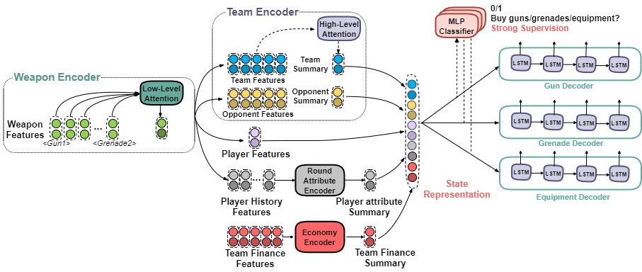

# Learning to Reason in Round-based Games: Multi-task Sequence Generation for Purchasing Decision Making in First-person Shooters

This is a baseline deep RL model for round-based game strategy learner.

This github repository serves as the artifacts repository for the paper "Learning to Reason in Round-based Games: Multi-task Sequence Generation forPurchasing Decision Making in First-person Shooters".

A good explanation of CS:GO economy strategy can be found [here](https://www.metabomb.net/csgo/gameplay-guides/csgo-economy-guide-2).

## Quick Links
- [Task](#Task)
- [Getting the Data](#Getting-the-data)
- [Method](#Method)
- [Model Architecture](#Model-Architecture)
- [Usage](#Usage)

## Task
The goal is to assign weapons and equipment to a target player each round. To deal with the intrinsic attributes and preferences of each team and each player, the problem is defined as few-shot learning. Each game is identified as a task. For each task, the model can observe k rounds (not necessarily need to be consecutive) as the support set. Predict player's weapon purchasing in the rest rounds. We formulize it as a sequence generation problem.

**Input**: player's current weapons and equipment, player's current money, other teammates' purchasing decision, opponent's previous round weapons and equipment, all players' performance score, round score.

**Output**: Weapon purchasing sequence.

**Evaluation**: F1 score


## Getting the Data
You can use CS:GO demo files and preprocess the structured data with [this visualizer](https://github.com/Brammz/csgo-demo-visualizer).

## Method

**Embeddings** are generated using self-supervised learning. Similar to word2vec, the action sequence is sorted in a certain manner (e.g. the player have to buy pistols first, then assault rifles, grenades, equipment). We predict the action before and after every action. Here's a t-SNE visualization:

<p align="center">
  
</p>

**Meta-learning algorithm**: Reptile

**Reward**: F1 score

**Objective function**: Self-critical


## Model Architecture


## Usage
### Installation
Install PyTorch (>= 1.4.0) following the instuctions on the [PyTorch](https://pytorch.org/). Our code is written in Python3.

### Dataset

Download dataset at [Google Drive](https://drive.google.com/drive/folders/1p3pH2zpSGgWNG7deNklBgapyhxEDITbq?usp=sharing) and put it in `data/dataset` folder. The raw dataset consists of json files extracted from demos. The 'processed.npy' is acquired by `src/preprocess.py`.

Dataset is processed in the `data` folder.
- 'action_capacity.npy': Capacity for each weapon.
- 'action_embedding.npy', 'action_embedding.xlsx': Action embedding file.
- 'action_money.npy': Cost of each weapon.
- 'action_name.npy': Name of each weapon.
- 'action_type': Type of each weapon -- guns, grenades, equipment.
- 'mask.npz': This file indicates what weapons can be purchased for two sides, terrorist and counter-terrorist.
- 'type_capacity.npy': Capacity for each type of weapons.
- 'type_name.npy': The name of each type.
- 'weapon_index.json': Indices of the weapons.

### Training
The following command can be used to train the model.
```
CUDA_VISIBLE_DEVICES=$GPU_ID
python3 run.py --mode='train' --history_encoding='score_weighted' --statedir=$MOVEL_SAVE_PATH
```

### Evaluation
To generate prediction on test set, simply change the `--mode` flag in the command above from `train` to `test`.
```
CUDA_VISIBLE_DEVICES=$GPU_ID
python3 run.py --mode='test' --history_encoding='score_weighted' --statedir=$MOVEL_SAVE_PATH
```