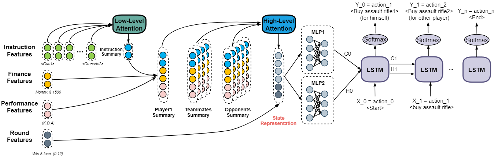
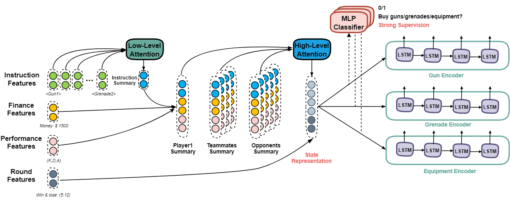

# Meta-learning for CS:GO Economy Strategy
This is a baselineb model for round-based game strategy learner.

This github repository serves as the artifacts repository for the paper "Learning to Reason in Round-based Games: Multi-task Sequence Generation forPurchasing Decision Making in First-person Shooters".

A good explenation of CS:GO economy strategy can be found [here](https://www.metabomb.net/csgo/gameplay-guides/csgo-economy-guide-2).

## Task
The goal is to assign weapons and equipments to a target player each round. To deal with the intrinsic attributes and preferences of each team and each player, the problem is defined as few-shot learning. Each game is identified as a task. For each task, the model can observe k rounds (not necessarily need to be consequtive) as the support set. Predict player's weapon purchasing in the rest rounds. We formulize it as a sequence generation problem.

**Input**: player's current weapons and equipments, player's current money, other teammates' purchasing decision, opponent's previous round weapons and equipments, all players' performance score, round score.

**Output**: Weapon purchasing sequence.

**Evaluation**: F1 score

## Getting the data
You can use CS:GO demo files and preprocess the structured data with [this visualizer](https://github.com/Brammz/csgo-demo-visualizer)

## Method

**Embeddings** are generated using self-supervised learning. Similar to word2vec, the action sequence is sorted in a certain manner (e.g. the player have to buy pistols first, then assult rifles, grenades, equipments). We predict the action before and after every action. Here's a t-SNE visualization:

  

**Meta-learning algorithm**: reptile

**Reward**: F1 score

**Objective function**: Self-critical

## Model Architecture
### Iteration 1

### Iteration 2

## Results
Greedy method will do full purchasing and buy as many weapons as possible starting from the most expensive ones.
| Method        | F1            |
| ------------- |:-------------:|
|Greedy Baseline| 0.26          |
|Iteration 1    | 0.31          |
|Iteration 2    | 0.56          |
